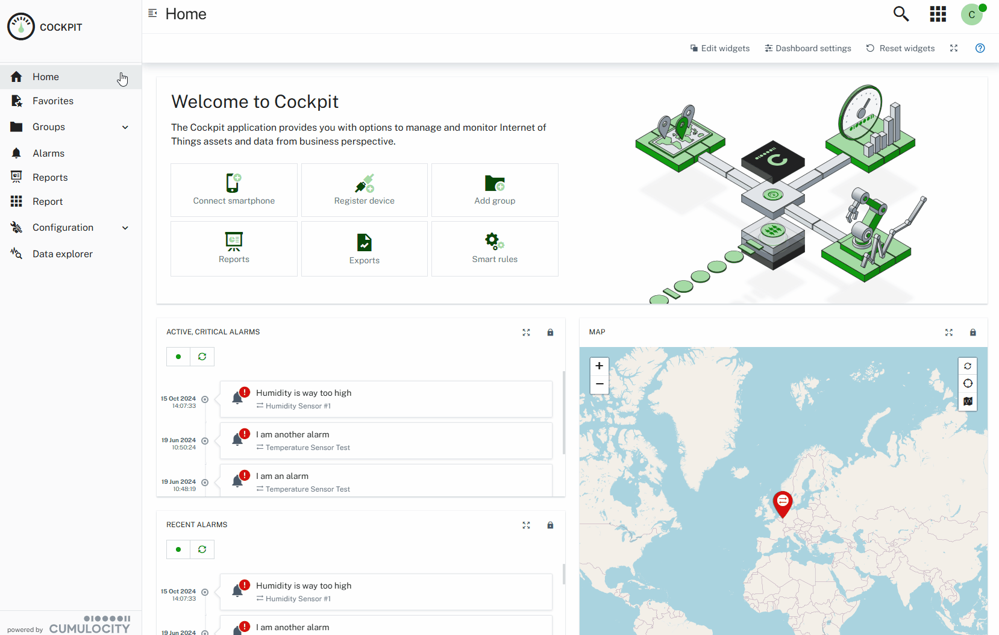
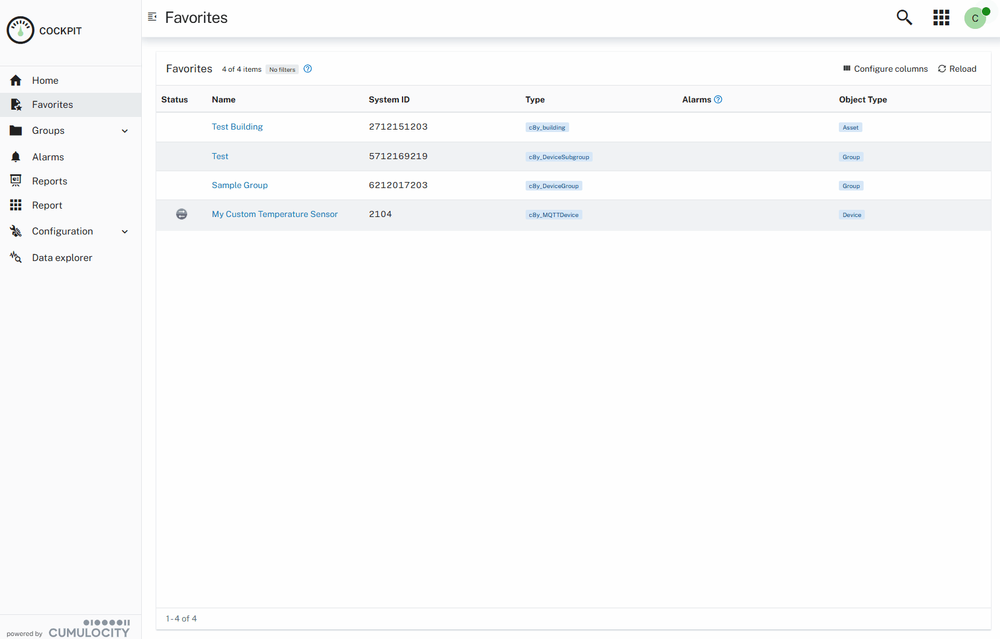

# Favorites Manager UI Plugin

## General

Access your favorite assets quickly by them to the your personal favorites list. You can mark any device, group or Digital Twin Manager asset as your favorite. No special permissions are needed to use this plugin, as the list of favorites is managed per account in the [currentUser](https://cumulocity.com/api/core/#tag/Current-User) object. Therefore, favorites are independent of individual sessions and the browser being used for a session.

**Important:** This Favorites Manager plugin will not work for users, which are managed via SSO (e.g. Azure Active Directory). The corresponding user object of these SSO users is immutable and can't be updated. File an [issue](https://github.com/SoftwareAG/cumulocity-favorites-manager-plugin/issues) if you require this plugin for SSO users.



Filter your favorite list to easier find your favorites you are looking for.



## Local development

### Prerequisites

- Node.js v20.x or higher
- npm v6.x or higher

### Plugin versions

- Angular v20.x
- WebSDK v1023.12.x

### Configuration

This project uses environment variables for configuration to keep sensitive data out of version control. Configuration is managed through a `.env` file that is not committed to the repository.

**Setup:**

1. Create a `.env` file in the project root directory
2. Add the following environment variables:

```bash
# Cumulocity tenant configuration
C8Y_TENANT=your-tenant-id
C8Y_BASEURL=https://your-tenant.cumulocity.com
C8Y_SHELL_TARGET=cockpit
C8Y_USERNAME=your-username
C8Y_PASSWORD=your-password

# Cypress testing configuration
C8Y_CYPRESS_URL=http://localhost:4200
C8Y_FAVORITES_ASSET_ID=your-test-asset-id
```

3. Replace the placeholder values with your actual Cumulocity tenant details

> **Important:** Never commit the `.env` file to version control. It should be listed in `.gitignore` to prevent accidental commits of sensitive credentials.

### Running the development server

The plugin uses `from-env` to load environment variables from the `.env` file and inject them into the Angular development server:

```bash
npm start
```

This will start the development server and automatically:
- Connect to your configured Cumulocity tenant (`C8Y_BASEURL`)
- Proxy the specified shell application (`C8Y_SHELL_TARGET`)
- Make the plugin available as a remote module

In Module Federation terminology, this plugin is the `remote` and the Cumulocity application (e.g., cockpit) is the `shell`. The shell will load the plugin modules at runtime.

Keep in mind that your tenant must have the shell application (e.g., cockpit) running with at least the same version as this plugin. If your tenant contains an older version, create an application clone with the correct version and reference it in `C8Y_SHELL_TARGET`.

### Running Cypress tests

Cypress tests use `dotenv` to load environment variables from the same `.env` file. The configuration is handled in [cypress.config.ts](cypress.config.ts).

**Open Cypress Test Runner (interactive mode):**

```bash
npm run e2e:open
```

**Run Cypress tests (headless mode):**

```bash
npm run e2e:run
```

The tests will automatically use the credentials and configuration from your `.env` file to connect to your Cumulocity tenant.

### Deployment

Deploying the plugin requires no special handling:

```bash
npm run deploy
```

This will build and upload the plugin to your configured Cumulocity tenant.

---

These tools are provided as-is and without warranty or support. They do not constitute part of the Software AG product suite. Users are free to use, fork and modify them, subject to the license agreement. While Software AG welcomes contributions, we cannot guarantee to include every contribution in the master project.

---

For more information you can Ask a Question in the [Cumulocity Community](https://community.cumulocity.com/).